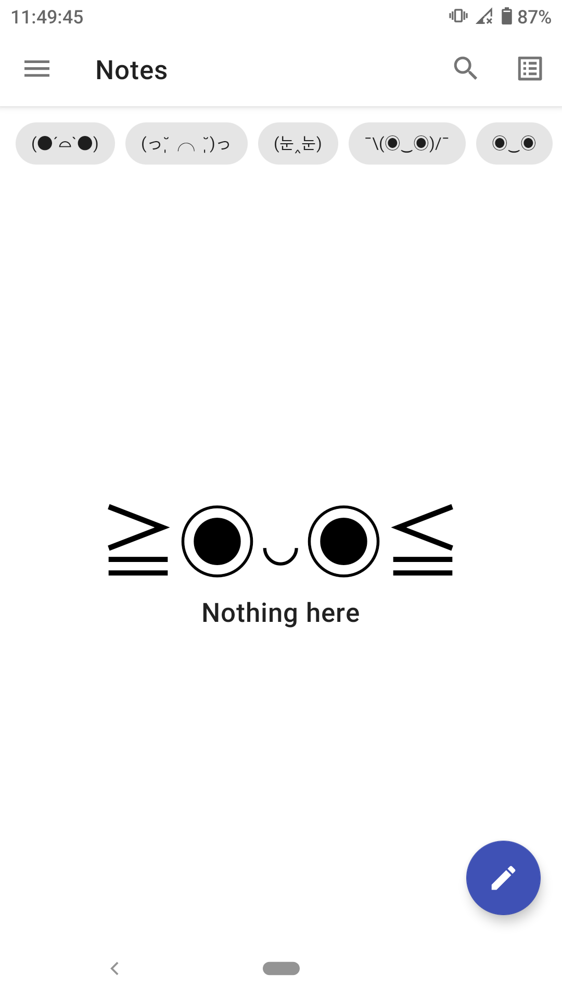
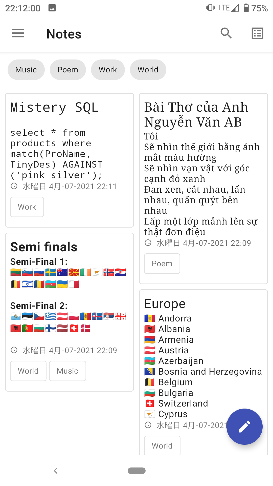
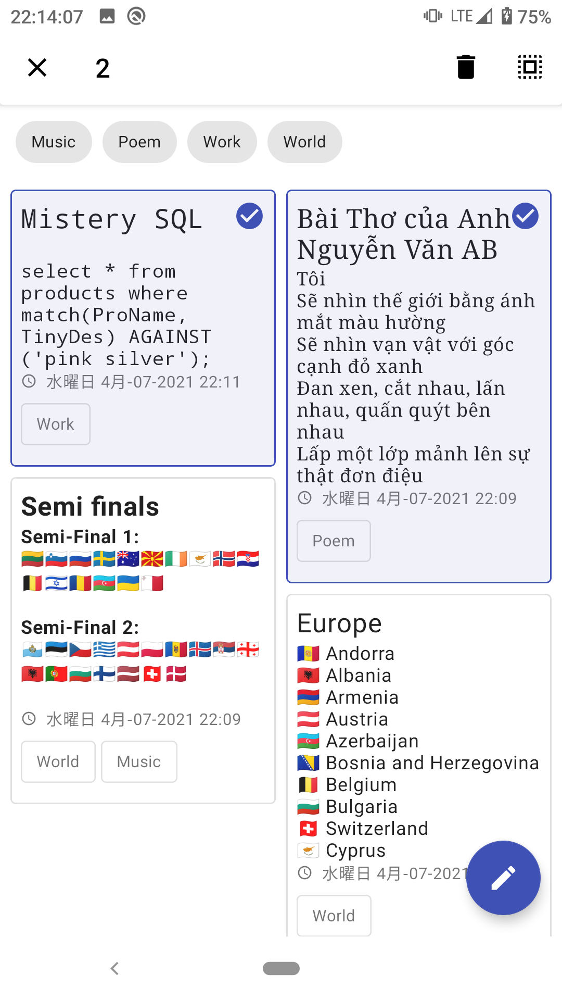
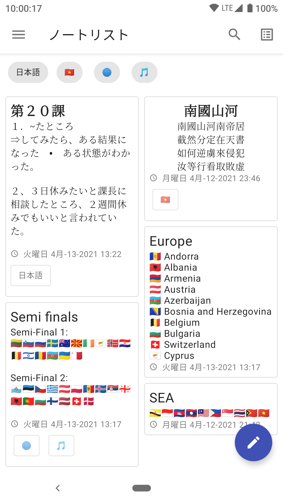
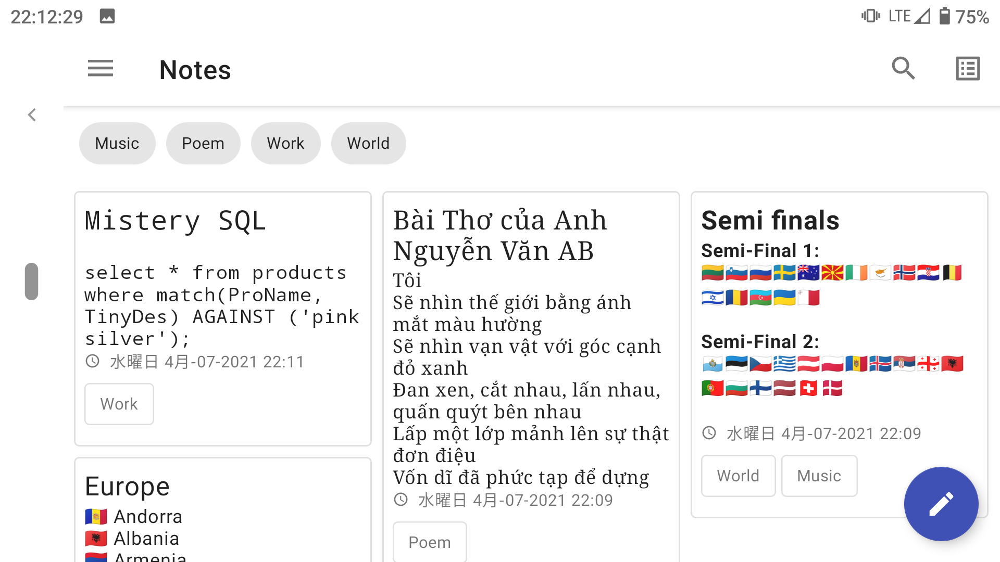
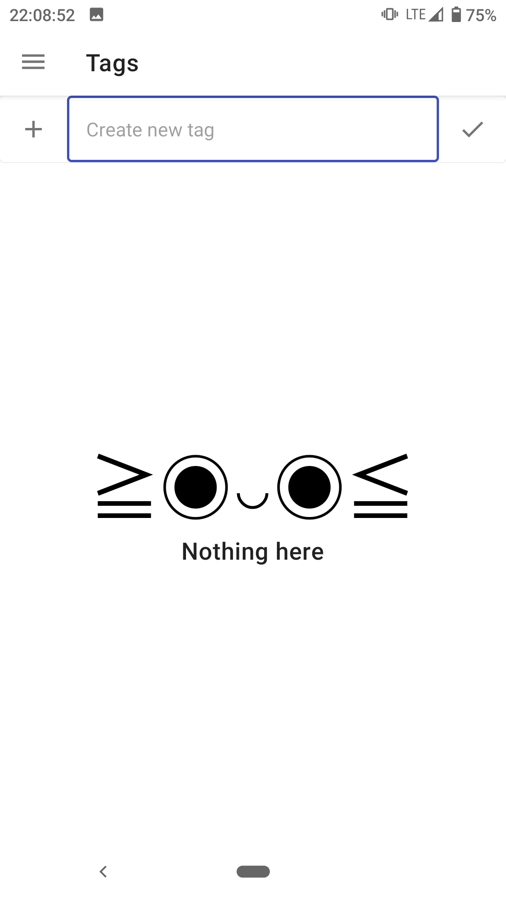
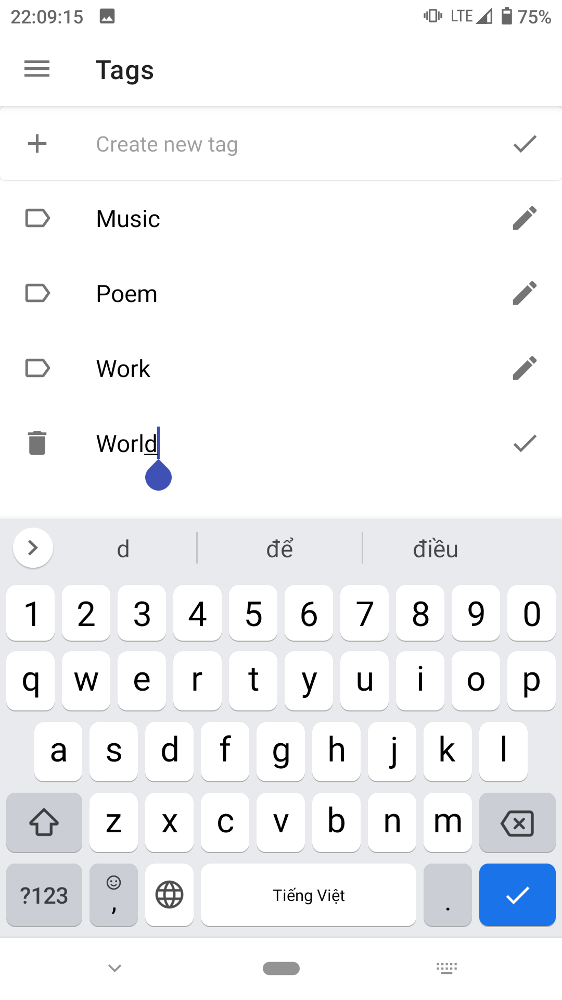

<h4 align="center">A simple note application for Android mobile devices.</h4>

<table width="100%">
    <tr>
       <td width="25%"> 
            <figure> 
                
                <figcaption>An empty list</figcaption> 
            </figure>
       </td>  
       <td width="25%"> 
            <figure> 
                
                <figcaption>A list of notes</figcaption> 
            </figure>
       </td> 
       <td width="25%"> 
            <figure> 
                
                <figcaption></figcaption> 
            </figure>
       </td> 
       <td width="25%"> 
            <figure> 
                
                <figcaption>A list of notes (but in Japanese)</figcaption> 
            </figure>
       </td>
    </tr>
    <tr>
        <td width="50%" colspan="2"> 
            <figure> 
                
                <figcaption></figcaption> 
            </figure>
        </td>
        <td width="25%"> 
            <figure> 
                
                <figcaption>An empty list of tags</figcaption> 
            </figure>
        </td>
        <td width="25%"> 
            <figure> 
                
                <figcaption>A list of tags</figcaption> 
            </figure>
        </td>
    </tr>
</table>
